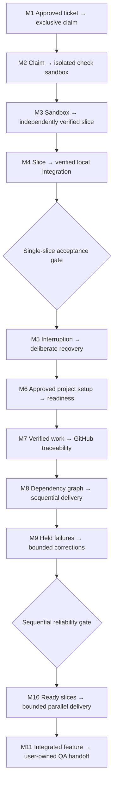

> **Historical copy (2026-10-06)** of root `docs/archive/implementation-plan-sandbox-2026-10-04.md`. Earlier sandbox M1/M2 plan, not an active approval or S0 gate.
> Original root note remains ignored and untouched. Paths written as `docs/...` below refer to original drafting locations; use [the package history index](../README.md) for relocated files.

# Historical implementation plan — sandbox-dependent routine

**Archived:** 2026-10-05. Retained for implementation/qualification history only.
**Current plan:** `docs/implementation-plan.md`. No instructions in this archive
authorize continuing sandbox work. Existing milestone acceptance/evidence remains
historical; sandbox design will be reconsidered in a separate later project.

**Updated:** 2026-10-05.
**Status:** earlier sandbox-required sequence superseded; workflow-first revision
in progress. M1 remains historically implemented and accepted; M2 remains partial
and unaccepted, but is no longer a blocker for the revised workflow.
**Active priority:** specify trusted local sessions in independent slice clones and replace the
sandbox-dependent milestone sequence. Implement the workflow first; sandboxing is
disabled for that scope and will be rethought/planned as a separate project later.
**Authority:** the current amendment in `docs/alignment.md` overrides sandbox
requirements in the historical plan below.

## Revision boundary — 2026-10-05

- Defer sandbox implementation and qualification, including the retained PID
  diagnosis, storage inspection/restart, firewall/proxy/network, credential delivery
  and provider-in-container work. They are not the next workflow tasks.
- Preserve existing source, tests, qualification history, retained checkouts and
  host configuration. No deletion, extraction into another repository, rollback or
  privileged action is authorized by this planning revision.
- Keep accepted workflow behavior: approved planning artifacts, deterministic
  claims/state, one-slice Orchestrators, Builder-owned tests/commits, independent
  Tester/Reviewer, bounded repairs and execution, verified serialized integration,
  dependency scheduling, traceable PRs, recovery and user-owned QA/final merge.
- Validate local tool/session behavior and workflow failure cases without claiming
  sandbox isolation. Separate checkouts are work separation, not security boundaries.
- Reassess existing M1 code/contracts for reuse; its acceptance does not establish
  compatibility with a yet-to-be-agreed local backend/profile.
- Checkout decision: one independent local clone per slice, in its own directory
  and branch with independent Git metadata; no worktrees or shared alternates.
  Bind its Orchestrator/subagents/tools to that clone and verify actual working
  directories. Preserve exact baseline/final anchors and controlled commit transfer
  into the feature integration path. Clones do not isolate shared host resources.
- Concrete local session execution and the replacement milestones are not yet agreed.
  Do not implement a bypass of existing fail-closed sandbox gates or launch host
  project commands merely from this scope decision.

## Historical sandbox-required plan and implementation checkpoints

The remainder records the previous plan and evidence. Its next-action instructions
and sandbox-dependent milestone gates are not current execution instructions.

**Previous priority:** bounded read-only diagnosis of the two retained PID failures
(2026-10-04), with plan/qualification updates only. S1/N1/C1 parallel implementation
is integrated; this instruction does not authorize further implementation or live
qualification. Production activation and new privileged,
mount, daemon/firewall, external-access or real-credential qualification still
require separate explicit approval. General crash/resume recovery remains M5.
Qualify a production-safe retained-checkout inspection
path and runtime persistence. A separately approved read-only raw-layer inspector
now verifies the stopped full fixture without remounting it or changing its quota.
Real quota enforcement, full-layer evidence collection, ordinary retention and
production setup-failure/timeout/state-denial checks also pass.
New runs now persist container/preparation identities, and CPU/memory/PID
enforcement historically passed actual container-local service commands; current
combined validation reopens PID qualification because both retained PID runs failed.
The earlier parallel M2 implementation authorization is recorded below; the current
task is diagnosis only. M3–M11 have not started; Gate A and Gate B remain unaccepted.
**Scope:** v1 of the routine itself, not a pilot product feature.
**Contracts:** `docs/alignment.md`.
**Terminology:** `docs/CONTEXT.md`.
**Regression findings:** `docs/loop-logic.md`.

Build and validate one complete single-slice path first. Add sequential dependency
execution next, then parallel scheduling. Each milestone below is implemented and
accepted sequentially.

The legacy loop supplies regression cases, not an execution mechanism. Do not
invoke or assume it. Preserve planning documents and existing uncommitted agent
edits. Approval of this plan does not start execution; a subsequent run instruction
authorizes implementation.

## Current checkpoint and next action

| Area | Current state |
|---|---|
| M1 authorization/claims/state | Implemented and accepted by the user |
| M2 offline baseline | Real quotas, full-layer evidence, setup failure/timeout, state denial, retention, collision protection and CPU/memory probes have passing evidence; current PID qualification is blocked despite its historical pass; privileged raw-path/mount qualification and restart remain open |
| M2 offline proxy | Component and launcher lifecycle positive/negative tests recorded; no approved external access |
| M2 profile-v3 environment layer | Policy compiler, lifecycle controller and credential-file primitive tested with injected adapters/fake secrets; production execution remains disabled |
| M2 S1 retained inspection | Bounded one-shot lifecycle and dedicated ledger sink implemented offline; production inspection remains disabled; privileged handoff and restart qualification proposals retained |
| M2 N1 network/firewall/DNS/proxy adapters | Concrete injected Docker/admin transactions and identity-bound readbacks implemented offline; trusted bootstrap/helper and live qualification remain open |
| M2 C1 services/credentials/providers | Service lifecycle, scoped file source and delivery/checkpoint wiring implemented offline; provider preparation is non-executable and actual OpenCode configuration remains blocked |
| Latest combined validation | 346 tests total: **328 passed, 18 live tests skipped**; existing live opt-ins: **345 passed, one PID probe failed safely**; the single PID-only recheck also failed; both fixtures retained, live qualification blocked |
| Retained PID diagnosis | Failure localized to the worker command/API path after service identity verification; fresh clients share the 64-task cgroup with the saturation probe. Control-path starvation is a hypothesis, not established enforcement/cause; private logs are permission-denied |
| Later milestones | Not started; do not treat component or modeled-policy passes as M2 acceptance |

**Next action:** obtain the narrow administrator read-only diagnostic approval
specified below, not another qualification attempt. Other bounded qualification
proposals still require separate explicit approval. Interfaces and ownership are recorded in
`docs/m2-interface-checkpoint.md`; track proposals are `docs/m2-storage-proposal.md`,
`docs/m2-network-proposal.md` and `docs/m2-services-proposal.md`. Actual OpenCode
provider configuration additionally requires authoritative local V2.0.22
documentation/source and an approved provider mapping; preparation is not
executable provider configuration.

The storage objective remains to turn the fixture-only proof into an approved,
production-safe retention/inspection design. Container/preparation IDs and a
fail-closed descriptor/provenance checker are implemented and tested locally;
privileged storage-root/xattr validation, descriptor-pinned Docker mount handoff
and bounded inspector lifecycle still need explicit approval and real qualification.
Prefer a narrow, one-shot trusted administration helper over a new general service.
The earlier raw-path mount was approved for one disposable fixture only,
not ordinary workers or general recovery. No project bytes need deletion and no
limit needs weakening. Then obtain specific approval
for a bounded daemon restart/persistence test. Production CPU/memory and
failure-path rechecks have passing evidence; current PID qualification remains
blocked. Bounded Docker-log rotation remains component
evidence rather than a privileged on-disk audit. Evidence collection no longer
needs writable-layer headroom. The user
approved and completed the recorded 50 GiB XFS/current-daemon
migration; see `docs/m2-qualification.md`. This is not approval for additional
filesystem/daemon/firewall changes or weakened limits.

### Read-only PID diagnosis checkpoint — 2026-10-04

The two specified fixtures preserve validated `api_failed` failure evidence with
`checks: []`, verified V2.0.22 service identity, exit 1 and confirmed stopping.
Current source/test hashes match the combined validation summary; the PID test,
worker, Compose adapter and sandbox path are unchanged from the parallel seed.
Both use the same probe/profile, 64 PIDs, 768 MiB/no swap and 128 MiB disk cap.
There is no recorded EAGAIN, cgroup PID-limit event or owned-child reaping proof
for these runs. Neither safe failure nor requested limits establishes enforcement.

`worker.py` maps a nonzero API CLI exit or invalid shell ID to `api_failed` and
discards CLI stderr. Each shell create/poll/output request starts a fresh client
inside the same cgroup as the finite saturation command. That coupling makes
control-path process/thread starvation a leading hypothesis, but available evidence
cannot identify the failed request, client/server failure or whether the probe
completed. No S1/N1/C1 change to this execution path was found; that does not prove
the absence of runtime/timing effects. Descriptor-relative, no-follow reads of both
existing upper-layer service logs failed with EACCES. No `docker cp`/export/archive
read was attempted: those can remount the stopped layer and violate this task's
no-new-mount boundary. No run or privileged action was performed.

**Exact next approval (diagnosis only):** authorize one administrator-performed
read-only examination of `/home/worker/service.log` from stopped containers
`b37f729e9e1266a9160d83b1e591339957cc24dab5709d251473e6d830e34407` and
`cacb2994c53e92a5f2da5c6761577bb3c5ac776125be0b89a9b92f9c4d7ba748`.
Freshly match their saved identities/stopped states through the pinned local Docker
socket, then securely walk only their existing recorded upper directories, reading
regular files with no-follow/no-atime descriptors. Bound the whole operation to
30 seconds and 256 KiB per log; absent/unsafe/oversized logs remain inconclusive,
not permission to broaden access. Return only redacted request-phase/error-class
observations; never generated passwords, authorization headers or raw repository
output. No mounts, source starts, permission/configuration changes, installed helper,
ledger edits, cleanup or production activation. Administrator-supplied safely
redacted observations are an alternative to granting agent privilege.

These logs may not identify a client crash because its stderr was discarded.
If inconclusive, request separate approval for narrowly scoped offline diagnostic
instrumentation (request phase, exit/signal and independent PID counters), preserving
all pass/EAGAIN/event/reaping assertions and limits. Any image rebuild or one fresh
instrumented diagnostic run needs a further explicit bounded approval; no automatic
rerun/retry. If starvation is confirmed, evaluate a control transport that does not
need fresh process/thread creation during saturation, not a larger PID cap or failure
accepted as a pass. This is M2 resource qualification, not M5 crash/resume.

## 1. Approved engineering choices

### M2 parallel integration checkpoint — S1 / N1 / C1

All three Sol high agents completed their owned implementation in isolated copies
seeded from current files. Integration rejected destination drift against that seed;
existing agent prompts, untracked package work and ignored documentation were
preserved. No commits, worker-image changes or new live capability were introduced.

S1 adds identifier-only bounded inspection components and a dedicated inspection
ledger sink/cooperative source lease. N1 adds concrete injectable Docker network,
nftables and namespace-DNS transactions with effective identity-bound readbacks and
owned proxy lifecycle. C1 adds bounded service creation/readiness/stopping, a scoped
file credential source and a non-executable provider manifest. Coordinator wiring
uses one durable environment checkpoint sink and the existing delivery primitive's
observable path interface. Combined offline positive and DNS-denial tests verify
ordering, provider-key exclusion, retained policy and confirmed consumer stopping.

Production inspection/environment execution remain disabled. Privileged xattr and
descriptor handoff, namespace/start interlock, live packets, credential UID/bind
delivery, actual OpenCode provider configuration and restart persistence are not
qualified. The existing delivery source was not inspected after permission denial;
combined fake-secret tests do not remove that review blocker. General crash/resume
remains M5. Named qualification proposals—not open-ended hardening—are the next
approval boundary; see the three track proposal documents.

These are implementation choices, not changes to the agreed product contracts.

| Area | Design |
|---|---|
| Launcher | Small Linux-only Python service/CLI; Docker Compose adapter; thin OpenCode V2 tools/plugins. No general scheduling framework. |
| Installation | New Stow package under `linux/opencode-routine/`. Keep installation separate from project onboarding. |
| Project profile | Versioned JSON at `.opencode/routine/project.json`: commands, services, network/mount policy, credential references, resource limits and QA behavior. |
| Planning inputs | Feature spec and tickets remain retained documents. An approval manifest pins their hashes, dependency graph and applicable criterion IDs. Runtime never appends operational status to them. |
| Runtime authority | Host-only JSON ledger under `$XDG_STATE_HOME/opencode-routine/`, protected by OS-backed locks. Atomic temporary-write, `fsync`, rename and directory synchronization. Logs are evidence, not another status authority. |
| Request interface | Typed operations for authorization, launch, status, collection, integration, recovery, stopping and QA. Callers provide identifiers—not arbitrary commands, paths or Compose fragments. |
| Identity | Feature/slice/run IDs plus immutable input hashes. Repeating an identical request returns its existing run; reusing an ID with different inputs fails. |
| Checkouts and transfer | Independent clones prepared from Git bundles, without shared alternates or host Git metadata. Workers return the complete commit range and evidence through controlled artifact collection. |
| Integration | Merge/rebase candidate preparation and repository commands run in disposable containers. Host retains candidate refs and publishes only the verified commit using an expected-head check. |
| Agent bundle | Locally owned, minimally adapted skills and role prompts, packaged into an immutable worker image. Record image/bundle identity for every run and recovery. |
| GitHub | Host-only credentials and idempotent PR operations, respecting approved project merge conventions. No automatic final merge into `main`. |
| Network boundary | Internal per-environment networks plus an approved egress proxy and host firewall enforcement. Deny direct outbound bypass, host/LAN, IPv6 bypass and cross-slice access. Compose network separation alone is insufficient. |
| Progress | Container-local tool/command instrumentation records command IDs, deadlines, exits and substantive progress. Host supervision owns timers. Service heartbeats and repeated output are not progress. |

**OpenCode-specific qualification:** pin the tested V2 release and verify its actual
configuration, tool hooks and subagent behavior. Worker configuration must exclude
unapproved repository/global plugins and MCP integrations; otherwise configuration
discovery could undermine the intended role restrictions.

Resource settings are mandatory profile inputs: CPU, memory, process and disk
limits, bounded logs, and command deadlines. They are validated during onboarding
rather than guessed for every project.

## 2. Dependency graph

This is the implementation graph for the routine, not the dispatch graph of a
future product feature. No implementation milestones run concurrently.

### M1 — Approved ticket → exclusive claim

**Status:** done; user accepted M1 and authorized continuation to M2.

**Implementation checkpoint:** `linux/opencode-routine/` contains the standalone
Python host launcher, strict v1 manifest/profile contracts, process-scoped
Coordinator leases, atomic ledger updates, idempotent claims and derived status.
Package-local `README.md` documents the interfaces and installation boundary.
Deterministic and real host-process tests cover the M1 path, including interruption
before/after ledger replacement: 25 tests pass with Python 3.14.7, including Stow
installation into a disposable temporary home. No host installation, worker launch, OpenCode adapter,
container qualification or live GitHub mutation was performed. Private host state
is enforced, but actual worker access denial must be validated in M2; this is not
acceptance of Gate A.

**Deliver:** authorize an immutable planning package, validate a launch request,
claim one slice, and expose durable status. No worker dispatch yet.

**Acceptance criteria**

- Reject unapproved or changed inputs, cyclic graphs, unresolved criteria, invalid
  profiles and unsatisfied dependencies.
- Duplicate requests produce one claim.
- Only one active Coordinator is admitted per feature; independent features remain
  distinguishable.
- Workers cannot write the ledger or locks.
- Planning documents remain unchanged; any backlog status display is derived.
- With no eligible work, return the reason rather than claiming alternative work.

**Tests:** concurrent duplicate requests, malformed inputs, stale authorization,
lock contention and interrupted atomic writes.

### M2 — Claim → isolated check sandbox

**Status:** in progress; stopped full-layer checkout recovery and broader storage
qualification remain blocking work. The following initial checkpoint is historical.
Docker access was granted and the user approved image
builds and disposable container tests. Docker 29.8.2 / Compose 5.5.1 use the
containerd `overlayfs` backend on this host. A real disk-fill probe demonstrated
that `storage_opt.size` is accepted but **not enforced**: 96 MiB was written under
a requested 64 MiB quota. The launcher now rejects this backend before dispatch.
No Docker daemon configuration or firewall rules were changed.

**Implementation checkpoint:** the first offline baseline path now includes
profile v2 pinned local-image/release identities, configuration-blind bounded Git
bundle export, generated quota-requesting Compose configuration, an image recipe
and a container-only baseline runner targeting OpenCode V2.0.22. The Coordinator's
typed `baseline` operation records preparation before side effects, submits
approved commands to the container-local service's shell API, validates bounded
commit/input-bound evidence, confirms stopping and retains the independent
checkout. A baseline pass is not slice verification/integration authority.
Approved profile-v2 regular-file inputs now require explicit content hashes, become
bounded private per-run snapshots (not live host-file binds), and are verified
read-only by the worker before setup. Evidence v2 records ordered input metadata;
it never exports input bytes. Directory/writable/external mounts remain unsupported.
Preflight additionally rejects missing cgroup v2 CPU/memory/swap/PID support rather
than trusting requested Compose options. CLI API requests share their command's
deadline; known shells receive at most two seconds of cancellation time within the
total budget. Late success and ambiguous/failed cancellation cannot establish a pass.

**Earlier component validation checkpoint:** 112 tests passed on Python 3.14.7 with the opt-in bounded
service/resource/proxy-component tests; the full baseline smoke test remains skipped.
The pinned Debian/OpenCode V2.0.22 image builds successfully. The live component
test demonstrates authenticated container-local service shell execution, read-only
configuration/root filesystem, bounded tmpfs and configured cgroup memory/PID
limits, filesystem/tool-locality canaries, denied host/LAN/IPv4/IPv6 outbound probes,
actual read-only snapshot hash/write-denial checks, and hash-only export of a
secret-output canary. It is a component test, **not** a
production storage workaround or full M2 acceptance. Host and adapter tests still
cover malicious Git config/hooks, bounded descendant termination, duplicate
launches, failed/timeout setup, missing/forged/raw evidence and unconfirmed stopping.
Input tests additionally cover authorization drift, directory-symlink races,
non-regular/hardlinked sources, copy/hash deadlines, combined preparation-byte
limits, snapshot independence and forged/missing/raw/boolean input evidence.
Real service checks now also deny host ledger/lock reads/writes and demonstrate a
one-second setup deadline (about 1.12 seconds including cancellation), with no live
descendant or delayed-write canary. Finite, read-only-root resource probes prove
CPU throttling, memory OOM handling, PID creation rejection, bounded tmpfs ENOSPC,
and Docker log rotation retaining only a bounded tail. Tmpfs exhaustion is not
production disk-quota qualification, nor is the log API an on-disk usage audit.
See `docs/m2-qualification.md` for image/input identities and recorded evidence.

**Egress component checkpoint:** the pinned bundle/image now includes a bounded
HTTPS CONNECT proxy with exact domain/Host/443 admission, all-answer public-address
validation, killable DNS, numeric dial/peer pinning, matching visible TLS SNI, and
connection/time/byte limits. Twenty-nine daemon-free tests and one bounded offline
image probe pass. The image probe uses injected DNS/peer identities and loopback,
not real approved external access. No production firewall/network setup or worker
egress proxy launch is enabled; baseline still rejects egress. Transparent CONNECT cannot inspect
encrypted HTTP routing: shared-endpoint domain fronting remains an explicit risk
to address before egress acceptance. The component does not satisfy the network gate.

**Offline proxy lifecycle checkpoint:** the typed `proxy-check` operation now
generates a bounded, immutable policy from explicit approved profile-v2 proxy
limits, pins image/bundle/profile/policy identities and manages a separate
read-only-root, `network_mode: none` proxy container. It validates effective
configuration and actual policy/assets before loopback-only listener readiness,
records creation intent before side effects, confirms stopping and retains policy,
Compose and allowlisted evidence. Completed duplicates are idempotent; interrupted,
held or pre-existing environments require deliberate recovery and block baseline
dispatch. Slice status remains claimed, and baseline cannot reset the preparation
budget consumed by the proxy check. No egress, firewall, service or credential
capability is granted. The existing image/bundle is unchanged.

Validation at that earlier host revision: 128 daemon-free tests passed, with ten
live tests skipped. The separate opt-in lifecycle suite passed all 25 tests,
including actual launcher positive and
modified-policy negative checks on the approved pinned image; both containers are
confirmed stopped and retained. Exact evidence is in `docs/m2-qualification.md`.
This validates the **offline** proxy lifecycle, not production proxy networking,
approved access or M2 acceptance.

**Gated environment implementation checkpoint:** profile v3 now pins explicit
service images/users/ports/readiness/resources/tmpfs, provider domains and
consumer-scoped development/model credential bindings. A deterministic compiler
generates a private deny-by-default topology/flow policy, not executable Compose or
installed firewall rules. Typed `environment-plan` retains immutable run-bound
artifacts; `environment-check` is unconditionally blocked before external side
effects by the current production adapter. No profile flag or Coordinator request
can turn a modeled policy or fake pass into execution authority.

The component lifecycle controller and broker-file primitive are implemented and
tested with injected adapters/fake secret bytes: journal intent, enforce policy
before any consumer, stage service-only credentials, enforce per-command/total
deadlines, verify readiness, stop in reverse order, and remove only owned credential
files after confirmed stopping. Provider credentials are not read for proxy/service
checks, proxies receive none, and values/secret hashes/raw diagnostics cannot enter
exported evidence. Uncertain stops/interruption hold further dispatch. No worker
implementation, integration authority or production credential source is added.

Validation: 29 new daemon-free environment tests; 157 pass across the normal suite,
with ten live tests skipped. These are **not** network/service/credential isolation
qualification. The concrete firewall/DNS/network and service Docker adapters,
trusted broker source and OpenCode provider configuration remain to implement,
approve and qualify. Actual encrypted-routing and hard disk gates remain open.

**Earlier local setup decision and steering:** the user previously declined VMs,
kept hard disk limits and deferred provisioning while gated implementation
continued. The user has now prioritized the writable-storage blocker before more
network/service/credential work. No VM, XFS disk image, additional daemon, package
installation or Docker configuration change has been provisioned. Provisioning
still needs separate approval; do not silently weaken the disk limit.

#### Storage slice — initial proposal and subsequent approved checkpoint

**Subsequent approved checkpoint:** the user chose a 50 GiB XFS disk image on the
existing Btrfs host and explicitly continued migration of the existing Docker
daemon, rather than the separate-daemon candidate below. Original stores and all
original tags are preserved; classic image config IDs replace containerd descriptor
IDs and require explicit runtime-profile reapproval. The existing pinned local
socket binding is unchanged. Real ENOSPC, actual baseline smoke and stopped-clone
inspection now pass. Full-layer `docker cp` fails because Docker itself needs
metadata headroom. A subsequent worker revision delivers allowlisted evidence via
bounded Docker logs and passes actual full-layer failure collection without freeing
bytes; stopped full-layer checkout recovery and restart qualification remain open.
Evidence and exact identities are in `docs/m2-qualification.md`.

**Storage failure/collection follow-up:** the worker emits one strict JSON evidence
envelope on stdout even when its local evidence file cannot be written. The adapter
reads the entire bounded log stream without mounting the layer; nonempty malformed,
duplicate, raw or oversized records cannot fall back to another channel. Empty logs
retain compatibility with older approved file-only images. Existing run/input/check
validation and container-exit agreement remain mandatory. Local evidence writes are
best effort; no checkout bytes are truncated/deleted and no quota is increased.

Worker creation now uses Compose `create --no-recreate`, an absence check and a
private preparation nonce. Start/stop address the verified immutable container ID,
not an unchecked name. A pre-existing container is held unchanged; a creation race
or replaced ID cannot be adopted or stopped. Interrupted runs remain held for
deliberate recovery; this is not the M5 recovery implementation.

Ten new daemon-free transport/ownership tests and five retained production-path
tests cover full-layer collection, pre-existing-container refusal, setup exit 7,
one-second setup timeout, host ledger/lock denial and ordinary stopped-checkout
inspection. Latest normal validation: **167 passed, 15 live tests skipped**. With
all existing/new live opt-ins: **182 passed**. The current image/bundle identities
changed explicitly; only disposable qualification profiles approve the revision.
The CPU/memory/PID/tmpfs/log and proxy/service component suites were also rerun;
component resource results do not replace all production-path resource rechecks.
No daemon restart/configuration, firewall, credential or network setup was changed.

**Subsequent separately approved read-only inspection:** the user approved one
offline, read-only-root inspection container mounting only the retained full
fixture's `UpperDir/home/worker/project`. Docker refuses `rprivate` for sources
beneath its data root; the successful bind uses one-way `rslave`, read-only and
nonrecursive, not bidirectional `rshared`. The inspector verifies the baseline
commit/run branch, complete Git object connectivity, independent metadata, retained
marker and 114,098,176-byte fill file; actual writes fail with `EROFS`. The original
container inspection is byte-identical, its 128 MiB quota is unchanged, and the
inspector is confirmed stopped and retained. No original restart or daemon/quota
change was required. Exact evidence is in `docs/m2-qualification.md`.

This closes the controlled fixture's readability question, not general production
recovery. Raw upper directories are not universally merged checkouts; lower-layer
content/whiteouts, source-ancestor symlinks and path races need a fail-closed design.
Host permissions prevented privileged ancestor inspection in this test, so safe
mount-source selection for untrusted worker data is explicitly unqualified. No
Coordinator operation or ordinary-worker mount policy was expanded.

**Retention-admission/resource follow-up:** baseline preparation records the private
launch nonce before creation and the verified immutable container ID before
recording `running`. Missing creation identity cannot pass. Earlier retained runs
without those fields cannot be implicitly adopted by future inspection; deliberate
administrative reconciliation is required, not a manual ledger edit.

`routine/retention.py` validates daemon/root/backend, durable container/nonce/image/
quota identity, stopped state and exact graphdriver paths. Its read-only descriptor
component rejects symlink ancestors, mount crossings (including same-device bind
mounts), lower-layer checkout content, OverlayFS metadata/whiteouts, links/special
entries, unsafe administrator-owned ancestry, file replacement and exhausted
entry/depth/byte/time bounds. Descriptors remain pinned across path swaps and close
on failures/interruption; exported scan counts contain no repository bytes/paths.
Twenty-four local contract tests exercise these checks. They do not qualify
privileged xattr visibility or the real Docker mount transport; production
inspection remains unconditionally disabled, with no Coordinator enable flag/API.

Three added actual-launcher probes establish CPU throttling at 0.25 core, memory
OOM under a 768 MiB/no-swap cap during a finite 1 GiB allocation attempt, and PID
creation rejection/reaping at 64 PIDs. OOM victim selection is not assumed: an
independent host cgroup observer must record an actual OOM-kill event. The run may
pass when only the allocation child is killed or retain a stopped `sandbox-failed`
when the service/client is killed; failure is never changed into baseline success.
The failed test checkpoints and safe-failure observation are retained. All existing
live components and offline lifecycle tests were rerun at the current host revision:
**210 passed**, no skips. Image/bundle identities are unchanged.

The inventory, candidate and approval sequence below record the **earlier
proposal**, not current setup or a standing ban on the specifically approved
migration. Further provisioning still requires its own approval.

**Problem:** the current Docker 29.8.2 containerd `overlayfs` snapshotter accepted
a 64 MiB writable-layer limit but allowed 96 MiB of writes. The launcher correctly
rejects this backend with `disk_quota_unavailable`. Writable files are permitted;
the blocker is the missing **enforced size bound**, not ordinary write permissions.
Read-only-root/tmpfs component tests are not a persistent checkout workaround.

**Read-only host inventory (2026-10-04):**

- The live daemon still reports Docker 29.8.2, `overlayfs`,
  `driver-type=io.containerd.snapshotter.v1`, with Docker root `/var/lib/docker`.
- `/var/lib/docker` and `/home/rbl` are backed by Btrfs, not XFS; `df` reported
  approximately 740 GiB available on the shared filesystem. This is capacity
  information, not approval to reserve it or proof of per-container quotas.
- `dockerd`, `docker`, `losetup` and `fallocate` are available. `mkfs.xfs` and
  `xfs_quota` were not found on `PATH`; package requirements must be checked before
  proposing installation.
- No existing/unmounted block device is an approved formatting target. Do not
  assume an unmounted or unrecognized filesystem means a disk is disposable.

**Candidate to evaluate, not an approved setup:** a bounded file-backed XFS
filesystem with project quotas and a **separate routine-only Docker daemon** using
classic `overlay2`. This avoids a VM and leaves the current Docker data, driver,
containers and service untouched. Validate kernel/loop/XFS/daemon compatibility
before recommending it. The current launcher admits only overlay2/XFS, and even
that combination must pass a real quota-fill test. Do not silently substitute a
different backend or mount a writable host project checkout.

**Implementation and approval sequence:**

1. **Propose exact host changes.** Specify image-file location and reserved size,
   XFS mount/quota options, package requirements, privilege requirements, isolated
   daemon data/exec roots/socket/PID file, and administration/start/stop ownership.
   Include capacity for images, logs and retained failed/successful checkouts;
   storage pressure must hold work, never prune evidence. Explain performance and
   host-filesystem impacts. For the first storage test, keep workloads offline and
   avoid provisioning bridge networks or changing host firewall/forwarding rules.
2. **Obtain specific approval before provisioning.** No filesystem formatting,
   package installation, mounts, service registration or daemon launch follows
   merely from plan approval. Do not change `/etc/docker/daemon.json` or restart the
   existing Docker daemon. A candidate rollback stops only routine-owned work and
   its daemon, confirms mount users are gone, then unmounts/detaches the dedicated
   storage; retained data/image deletion requires its own explicit authorization.
3. **Prove the storage gate in disposable containers.** Use a separately approved
   pinned local image and finite non-root writes. A requested 64 MiB quota must
   prevent a synchronized 96 MiB write attempt (`EDQUOT`/`ENOSPC`), with exact
   committed-byte, image, daemon, filesystem and container identities recorded.
   Include a within-quota success case and retain diagnostics. Inspection options
   or total image-file capacity alone are not enforcement proof.
4. **Bind the launcher through trusted administration.** The current adapter pins
   `/var/run/docker.sock`; a separate daemon needs an explicit approved local
   runtime binding, recorded with run identity. Do not inherit `DOCKER_HOST`, Docker
   contexts, credentials or arbitrary Coordinator-supplied socket paths. Preserve
   image/bundle/release checks, cgroup checks, fail-closed quota admission and narrow
   identifier-only requests. Transfer only approved image artifacts through Docker
   interfaces, never copy/manipulate the current daemon's data directory.
5. **Qualify the actual baseline path.** Run authorization → claim → bounded Git/input
   preparation → independent container clone → container-local OpenCode checks →
   allowlisted collection → confirmed stop → retained checkout inspection. Prove
   checkout/evidence persistence under the approved routine daemon's stop/restart
   lifecycle, without disturbing the existing daemon. Exercise writable-layer
   exhaustion, setup failure/timeout, resource/log bounds, host ledger/lock denial,
   malicious repository discovery and unconfirmed stopping through this production
   path. Keep failed artifacts; do not manually reset the ledger to repeat a run.

**Exit criteria for this slice:** real writable-layer quota enforcement and
persistent independent-checkout retention are demonstrated through the actual
launcher, with recorded positive/negative evidence tied to the tested host
revision/image/profile/runtime. Normal contract tests remain green. This closes
the storage/offline-baseline blocker only: it is **not** full M2 or Gate A acceptance.

**Remaining M2 work (implementation tracks may now proceed in parallel):**

1. Qualify production-safe retained-checkout inspection/recovery and approved runtime
   restart/persistence. A separately
   approved read-only raw-layer inspector now verifies the stopped full fixture.
    Local admission/path-descriptor contracts and actual production CPU/memory
    checks have passing evidence; PID qualification is reopened by the latest two
    failures. Privileged source validation/mount handoff remain unqualified.
   Full-layer evidence collection, real fill, baseline smoke, ordinary retention,
   setup failure/timeout, state denial and container-collision protection now pass.
2. Qualify the concrete injectable network/firewall/DNS and service adapters and
   scoped credential source/delivery. Offline transaction/lifecycle implementation
   now exists; real execution does not. Implement actual OpenCode provider setup
   only after resolving its documented mapping/profile blocker.
3. Integrate and qualify approved proxy access/endpoints, address encrypted-routing
   risks, and demonstrate host/LAN, IPv6 bypass, direct egress, DNS and cross-slice
   denials together with service/credential isolation.
4. Run the full M2 positive/negative qualification suite and obtain acceptance before
   proceeding to M3. The smoke test alone is not that suite.

Current launches deliberately reject unsupported capabilities and use
`network_mode: none`; file-only snapshot support is not arbitrary project mounting,
and deny-all networking is not a substitute for the approved network design.
Previously retained component containers and built image revisions remain retained;
the recorded test containers were confirmed stopped at their test checkpoints.

**Deliver:** prepare an independent fixture clone, start its Compose environment,
execute a baseline check, collect evidence and stop it safely.

**Acceptance criteria**

- Actual tools execute inside the container-local OpenCode service—not the host
  service.
- Clone Git metadata is independent; no alternates, Docker socket, full-home or
  SSH-agent mount.
- Only approved mounts, services, dependencies, providers and credential references
  are available.
- Host/LAN, cross-slice and unauthorized egress probes fail; approved access succeeds.
- Setup scripts execute only in the container. A malicious repository
  hook/configuration cannot execute on the host.
- Setup failure produces diagnostics, never completion; retained artifacts remain
  available.
- Resource limits and evidence redaction are demonstrated.

**Tests:** filesystem/process canaries, network probes, malicious
hooks/configuration, secret-leak canaries and setup timeout.

### M3 — Sandbox → independently verified slice

**Deliver:** one Slice Orchestrator delegates to Builder, Tester and fresh-session
Reviewer, then returns a structured result.

**Acceptance criteria**

- Every role can access the full spec, ticket and explicit applicable criteria.
- Builder owns TDD, committed tests, scoped refactoring and clean commits.
- Tester cannot change product code or committed tests; Reviewer is read-only.
- Checks, review and coverage refer to the exact final commit and complete slice
  range.
- Missing evidence, failed required checks or unresolved blocking findings prevent
  admission; advisory findings do not.
- Any mutation invalidates affected checks/review.
- One shared budget permits at most two corrective implementation passes. Initial
  TDD failures do not consume repairs.
- Scope changes and contract disagreements escalate rather than changing criteria.
- Orchestrator stops after its slice; no mandatory Refactorer/Cleaner stages or
  Tester repair loop.

**Tests:** real subagent filesystem/tool execution, role-permission violations,
missing criteria, post-review mutation, test removal, and A→B→A failure cycling.

### M4 — Verified slice → verified local feature integration

**Deliver:** collect a result, retain a combined candidate, verify it in a
disposable environment, then advance a local feature branch.

**Acceptance criteria**

- Admission validates evidence and commit ancestry; a worker's “ready” report is
  not merge authority.
- Verify the exact combined commit before publishing.
- Candidate failure or timeout leaves the last verified feature head unchanged.
- Feature integration is serialized; a moved head prevents publication of a stale
  candidate.
- Failed candidates and diagnostics remain inspectable.
- Integration verification includes applicable checks and review of the combined
  result.

**Tests:** conflicting commits, a clean merge with failing combined behavior, stale
head, forged/mismatched evidence and integration timeout.

**Gate A:** a real OpenCode single-slice run completes claim → isolated
implementation → independent checks/review → verified integration. The
corresponding negative cases must also pass. Scheduling does not begin before this
gate.

### M5 — Interruption → deliberate recovery

**Deliver:** supervise work independently of the Coordinator and recover explicitly
from durable checkpoints.

**Acceptance criteria**

- Coordinator loss holds new dispatch/integration while existing workers finish
  within their budgets.
- Worker interruption preserves checkout/evidence; reassignment requires confirming
  the old worker is stopped.
- Recovery starts a fresh session with pinned inputs/bundle and consumed time/repairs
  intact.
- Exhausted budgets require user-authorized extension.
- Quiet tracked commands are allowed until their deadlines; dead commands cannot
  mask inactivity.
- Default limits are 60-minute slice runtime, 10-minute inactivity and 30-minute
  integration runtime, starting at preparation—not capacity waiting.
- Stop-feature stops automatic environments without rolling back verified
  publication or stopping user QA.

**Tests:** process termination around preparation, launch, commit, checks,
collection, candidate verification and publication. Include a remote publication
that succeeds immediately before the launcher crashes: recovery must reconcile it,
not publish twice.

### M6 — Approved project setup → revision-specific readiness

**Deliver:** reusable onboarding skill and profile validation.

**Acceptance criteria**

- Separate discovery/proposal from mutation; obtain approval before scaffolding,
  installation, provisioning or configuration edits.
- Reuse existing project conventions and do not overwrite credentials.
- Validate setup, named agents/tools, baseline checks, services and QA accessibility
  in a disposable independent clone.
- Readiness pins project revision, profile and relevant configuration identities.
- Pre-existing baseline failures need explicit narrow exceptions; exceptions stay
  visible and cannot cover new feature failures.
- New-project bootstrap has explicit tests for the feedback infrastructure it
  creates.

**Tests:** existing/new fixture projects, missing checks, approved exceptions,
profile drift and attempted unapproved setup.

### M7 — Verified work → GitHub traceability

**Deliver:** host-controlled slice PRs, final feature PR and gated remote feature
publication.

**Acceptance criteria**

- Workers contain no PR-management credentials.
- Retried GitHub operations do not create duplicate PRs.
- PRs link planning inputs, run IDs, complete commit range and verification evidence.
- Slice PR records are preserved; their creation does not advance unverified feature
  code.
- Remote feature publication uses the exact verified commit and expected remote
  head.
- GitHub failure remains recoverable without false completion.
- Required checks/protection proposals require setup approval; manual/admin
  enforcement limits are documented.

**Tests:** fake GitHub adapter failures plus an explicitly approved disposable
GitHub repository exercise. No live GitHub mutation without that authorization.

### M8 — Approved graph → sequential dependency delivery

**Deliver:** adapt `implement-spec` for the Coordinator and execute one slice at a
time.

**Acceptance criteria**

- Fixture graph contains two independent slices and one contract-owning slice with
  a consumer.
- Consumer waits for verified integration and starts from the recorded newer
  feature baseline.
- Single-slice mode dispatches exactly one slice.
- Default batch selects at most three ready slices once, executes them sequentially
  here, and does not refill.
- Explicit whole-feature mode may continue with newly ready slices.
- Failed prerequisite blocks its dependency chain, not unrelated authorized work.
- Cross-feature dependency waits for the prerequisite's approval and merge into
  `main`; no branch stacking.
- Coordinator uses only approved artifact reads and launcher operations.

**Tests:** dependency ordering, no-refill behavior, authorization boundaries and
waiting versus unavailable-work reporting.

### M9 — Held failures → bounded corrective work

**Deliver:** technical reconciliation and full-spec omission correction.

**Acceptance criteria**

- Hold affected integration and new consumers; running affected outputs remain
  provisional.
- One reconciliation run per recorded conflict group, using normal time/repair
  limits.
- Further failure or contract change escalates; no recursive dispatch or renamed
  groups to reset limits.
- Full-spec review detects requirements omitted by tickets.
- At most one completion-correction slice per feature—not one per finding.
- Corrections preserve approved contracts and require renewed combined
  checks/review.

**Tests:** technical conflict resolved, reconciliation exhausted, contract
disagreement, multiple omissions handled together and attempted budget reset.

**Gate B:** the sequential workflow passes isolation, failure, recovery,
authorization and corrective-work tests before parallel execution is enabled.

### M10 — Ready slices → bounded parallel delivery

**Deliver:** concurrency without changing the preceding contracts.

**Acceptance criteria**

- Default per-feature concurrency is three; initial host-wide worker cap is three,
  including reconciliation/correction.
- Separate host-wide integration-check cap is three; integration remains serialized
  per feature.
- Capacity claims are atomic and recovered without duplicate live environments.
- Waiting does not consume runtime.
- Default batches still do not refill; whole-feature mode remains explicit.
- Independent Coordinators compete safely for capacity.
- User QA is outside both pools but visible in load reporting.

**Tests:** simultaneous features, three-slot saturation of each pool, queued
workers/checks, cancellation, recovered reservations, stale publication and
concurrent independent slices.

### M11 — Integrated feature → user-owned QA handoff

**Deliver:** synchronize with latest `main`, reverify/review, and produce
review-ready handoff with explicit QA controls.

**Acceptance criteria**

- Handoff identifies exact verified feature commit/main baseline, full-spec
  coverage, checks/review, PRs, risks, structural summary and QA checklist.
- QA is not started automatically; explicit start/status/stop supports browser and
  non-browser projects.
- User QA remains running until explicitly stopped; automatic cleanup/stop-feature
  does not remove it.
- If `main` advances during QA or before merge, hold acceptance,
  synchronize/reverify, refresh the preview/handoff and request renewed approval.
- User performs final merge into `main`; no deployment.
- Successful generated checkouts remain until acceptance. Failed/interrupted
  checkouts require explicit cleanup.
- Specs, historical planning, summaries, PR references and verification evidence
  survive cleanup and storage pressure.

**Tests:** stale `main`, stale approval, QA lifecycle, cleanup boundaries and
optional finished-feature Recaper behavior.

## 3. Validation strategy

Use three complementary layers:

1. **Deterministic contract tests:** fake clock, injected crashes and fake
   Docker/GitHub/provider adapters. Exercise every state transition and
   external-side-effect boundary.
2. **Real container tests:** disposable Git fixtures, actual OpenCode subagents,
   command tracking, filesystem/network/credential isolation and combined
   integration failures.
3. **Authorized end-to-end qualification:** disposable GitHub repository, complete
   sequential feature, then parallel feature and final QA lifecycle.

Mocks cannot establish isolation or actual subagent tool locality. Happy-path
demonstrations cannot establish recovery. Every claimed gate needs recorded
positive and negative evidence tied to the tested revision, image and profile.

### Explicit coverage of the legacy findings

| Finding | Planned proof |
|---|---|
| S1 — Criteria invisible | M1/M3: packaged spec, ticket and criterion mapping accessible to Builder |
| S2 — Mutation after verification | M3/M4: commit-bound evidence invalidation and renewed verification |
| S3 — Two status authorities | M1: one host ledger; documents never become writable runtime state |
| S4 — Incomplete recovery | M5: checkpoint-by-checkpoint interruption and recovery |
| S5 — Clobbered shared state | M1/M5: host-only writes, locks and atomic updates |
| S6 — Incomplete final range | M3/M7: start/final anchors and complete contribution range |
| S7 — Oscillating failures | M3/M5: failure history, meaningful-progress assessment and fixed budgets |
| S8 — Excess permissions | M2/M8: deny broad Coordinator tools; test narrow launcher authority |
| S9 — Shrinking tests | M3/M9: preserve tests across repairs; reject coverage weakening |
| S10 — Prompt-only scope | M3: final-diff containment gate against ticket constraints, with justified internal additions |
| S11 — Unbounded execution | M3/M5/M9/M10: persisted time, repair, correction and capacity limits |
| S12 — Inconsistent phases | M3/M8: role-based flow and one authoritative workflow description |
| S13 — Duplicated/wrong diagrams | M8/M11: shared diagram guidance; validate any actual tool reference |
| S14 — Tester owns repairs | M3: Tester reports; Orchestrator dispatches bounded Builder corrections |
