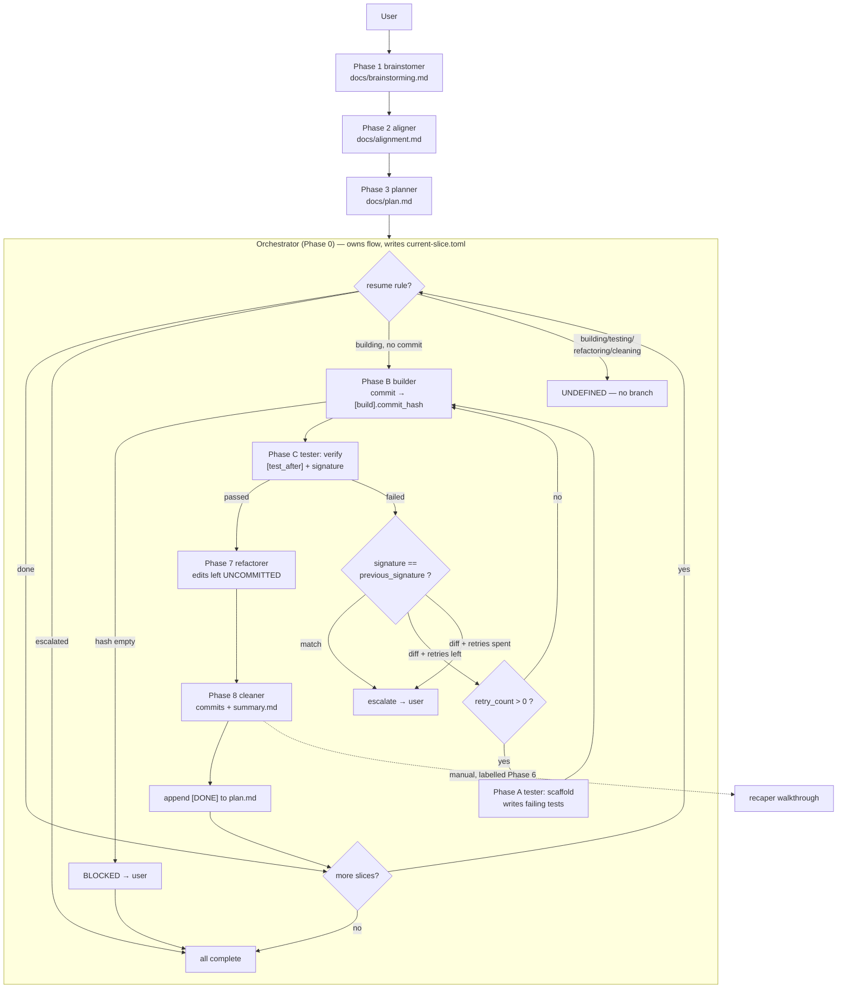

> **Historical copy (2026-10-06)** of root `docs/loop-logic.md`. Legacy multi-slice loop analysis, not the S0 execution contract.
> Original root note remains ignored and untouched. Paths written as `docs/...` below refer to original drafting locations; use [the package history index](../README.md) for relocated files.

# opencode Loop Logic — Current-State Analysis

**Date:** 2026-10-03
**Status:** analysis only — no agent files changed
**Scope:** the multi-agent execution loop, as a precondition for rethinking it

## Files examined

All under `common/opencode/.config/opencode/`:

| File | Role in the loop |
|---|---|
| `agents/orchestrator.md` | Phase 0. Owns flow control, writes `current-slice.toml` |
| `agents/planner.md` | Phase 3. `docs/alignment.md` → `docs/plan.md` |
| `agents/builder.md` | Phase 4. Subagent. Implements the active slice, commits |
| `agents/tester.md` | Phase 5. Subagent. Dual-mode: `scaffold` / `verify` |
| `agents/refactorer.md` | Phase 7. Subagent. Leaves edits uncommitted |
| `agents/cleaner.md` | Phase 8. Subagent. Atomic commits, writes slice summary |
| `agents/recaper.md` | Labelled Phase 6, actually runs after Phase 8 |
| `agents/brainstomer.md`, `agents/aligner.md` | Phases 1–2, upstream of the loop |
| `opencode.jsonc` | Global permissions, MCP servers |

## The loop as specified

Note: the `drawio` MCP server is configured (`opencode.jsonc:72`) but was not
reachable from the session that produced this analysis, so the diagram is inline
Mermaid rather than a `.drawio` artefact.

## Findings

| # | Finding | Severity |
|---|---|---|
| S1 | Builder cannot read the acceptance criteria it must satisfy | Blocker |
| S2 | No verification gate after the Refactorer mutates code | High |
| S3 | Two sources of truth for slice status | High |
| S4 | Three resume states have no branch | High |
| S5 | Whole-file TOML rewrites will lose other agents' keys | High |
| S6 | Recorded commit is pre-refactor; archives understate the work | Medium |
| S7 | Stall detection misses oscillating failure sets | Medium |
| S8 | `shell: "*" → ask` on an agent that never uses shell | Medium |
| S9 | Scaffold semantics undefined — overwrite vs accumulate | Medium |
| S10 | Builder scope containment is prompt-only | Medium |
| S11 | No budget ceiling on the loop | Medium |
| S12 | Phase numbering inconsistent; contradicts `CONTEXT.md` | Low |
| S13 | Diagram boilerplate duplicated 3×; wrong tool name | Low |
| S14 | Tester's "Self-Verification Hook" contradicts its own mandate | Low |

### S1 — The Builder cannot see the acceptance criteria (Blocker)

`builder.md:6` states the TOML is the Builder's *sole source of truth* and that it
must **not** read `docs/plan.md`. But the schema at `orchestrator.md:22-49` carries
only `[slice].name` — no acceptance criteria, no context, no expected file list.
Nothing in Phases 1–3 copies the slice body into the TOML, and the dispatch
convention (`orchestrator.md:102`) passes only the TOML path.

The Builder is instructed to implement to criteria it has no way to read. The
`[tasks]` table in the schema is declared "freeform" and is read by no phase.

### S2 — Nothing verifies the code after the Refactorer runs

Phase C gates on `[test_after].passed = true` (`orchestrator.md:82`), then Phase D
rewrites behaviour-adjacent code. The Refactorer is *self-asked* to run lint and
typecheck (`refactorer.md:22-25`) but the Orchestrator never inspects the result
and there is no second verify pass. A refactor-induced regression is marked
`[DONE]`.

### S3 — Two sources of truth for slice status

`docs/plan.md` headings get `[DONE]` appended (`orchestrator.md:93`) **and**
`current-slice.toml` carries `status`. Resume rules key off the TOML
(`orchestrator.md:63`). `CONTEXT.md:9-10` documents this split as intentional —
`plan.md` is the permanent record, intermediate state lives only in the TOML — but
nothing reconciles the two. If the slice-discovery regex is anchored at the end of
the line, it stops matching after the first `[DONE]` append.

### S4 — Three resume states have no branch

Rules cover `done`, `building` with empty `commit_hash`, and `escalated`
(`orchestrator.md:63-65`). A crash in Phase C or D leaves `testing`,
`refactoring`, or `cleaning` — undefined. So does `building` **with** a commit
hash, which is exactly the state reached if the Orchestrator dies between Phase B
and Phase C.

### S5 — Whole-file TOML rewrites will lose other agents' keys

The Orchestrator rewrites the entire file at each transition (`orchestrator.md:73`,
`:79`, `:86`). Meanwhile the Builder writes `[build]`, the Tester writes
`[test_after]` and `[stall_detection]`, and the Refactorer appends to
`[build].summary`. No key ownership or merge discipline is stated in any file.

A stale read-modify-write produces a concrete failure: the Tester clobbers
`[build].commit_hash`, the Orchestrator reads it empty, and `orchestrator.md:76`
declares a false BLOCKED. Or the Refactorer loses its diff anchor and cannot scope
its work at all.

### S6 — The recorded commit is pre-refactor

`[build].commit_hash` is the Builder's commit. The Refactorer leaves edits
uncommitted (`refactorer.md:26`); the Cleaner commits them separately. The Cleaner
then writes `summary.md` listing `git diff <commit_hash>~1..<commit_hash>`
(`cleaner.md:19`) — Builder files only. The `[DONE]` marker in `plan.md` points at
a commit that is not the finished state of the slice.

### S7 — Stall detection misses oscillating failure sets

`[stall_detection].signature` is compared only against `previous_signature`
(`orchestrator.md:84`). An A→B→A failure cycle is a mismatch every time, so it
burns all three retries before the `max_retries` branch escalates. A set of seen
signatures would catch the cycle on the second repetition.

### S8 — Unnecessary permission prompt on the Orchestrator

`orchestrator.md:6-9` grants `shell: "*" → ask`, but the Orchestrator's spec never
uses the shell — it parses a file and writes TOML. The per-agent block also shadows
the global `git diff * → allow` at `opencode.jsonc:26`.

### S9 — Scaffold semantics undefined

On every retry the loop re-enters Phase A (`orchestrator.md:86`), which re-runs the
Tester in `scaffold` mode. `tester.md:11-13` says to write failing tests and not fix
them, but never says the new scaffold must *preserve* tests written by earlier
attempts. Each retry risks shrinking the suite to only the newest failures.

### S10 — Builder scope containment is prompt-only

`builder.md` has no permissions block, so it inherits global `edit: allow`. The
Refactorer gets a hard diff scope; the Builder has none and cannot be given one up
front, since its file set is not knowable before it runs. This needs a post-commit
containment check against a declared expected-file list.

### S11 — No budget ceiling

Up to four subagent sessions per attempt × four attempts × N slices, uncapped.
Relevant while the `#TODO ... revisit cost and quality` markers sit on
`orchestrator.md:4`, `cleaner.md:4`, `brainstomer.md:4` and `recaper.md:4`.

### S12 — Phase numbering is inconsistent

`recaper.md:2` claims Phase 6, but it runs after Phase 8 (`orchestrator.md:92`).
`CONTEXT.md:21` goes further and lists the loop as "build → test → **recap** →
refactor → cleaner", i.e. the recap is inline rather than a post-slice manual
prompt. Three sources disagree about where the Recaper sits.

### S13 — Diagram boilerplate duplicated 3×, with a wrong tool name

Verbatim in `brainstomer.md:29-38`, `aligner.md:31-40` and
`orchestrator.md:104-113`. Each names the tool `drawio_open_drawio_mermaid`, which
is not the callable path — in Code Mode it is
`tools.drawio.open_drawio_mermaid`.

### S14 — Tester's directive contradicts its own mandate

`tester.md:6` says "You do **NOT** decide what happens next — the Orchestrator owns
flow control." `tester.md:44` then invites the Tester to "establish a clear
Self-Verification Hook… so you can iterate on alternative solutions
autonomously". That is exactly the flow control the Orchestrator owns.

## Open questions for the redesign

1. **Where does slice truth live?** (a) one immutable `plan.md` plus a pure-TOML
   state machine, with `plan.md` never mutated; (b) fold the acceptance criteria
   *into* the TOML and retire `plan.md` as a live document; (c) keep both, make
   `plan.md` a generated artefact.
2. **Is the retry loop the right shape?** Alternatives: fold scaffolding into the
   Builder so tests are part of the slice, or move verification to a per-slice gate
   that re-runs after every mutating phase instead of once before Phase D.
3. **Does the Orchestrator stay a prompt?** It is ~100 lines of prose state machine
   re-derived from a TOML file on every run — the classic candidate for a plugin
   hook or a script, leaving the Orchestrator responsible only for dispatch.

S1 blocks any of these until the criteria are reachable by the Builder.

## Related

`~/.opencode/plan/O11-parallel-pipeline.md` is parked and explicitly deferred "for
a brainstorming session". Both of its open decisions — how much structure to add,
and the `steps` caps — were deliberately left unanswered. It analyses the same
loop and should be read alongside this document.

`CONTEXT.md` is the existing glossary for this pipeline. Several findings above
(S3, S12) contradict it, so it needs reconciling whenever the loop is redesigned.